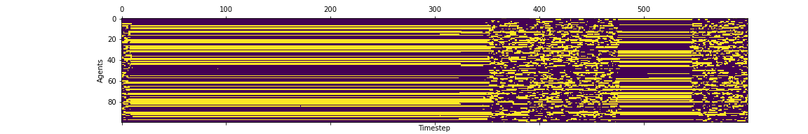

## CCC Model
This is a simple CCC (co-evolving combinatorial critical) model to demonstrate properties of complex adaptive systems, such as punctuated equilibrium and power-law scaling.

Each agent has a binary state. The interaction tensor specifies creation and destruction rules (i,j) -> k which are applied randomly.   
If the cumulative creative interactions are greater than (resp. less than) the destructive ones, the agent k lives (resp. dies).   
For more details see [1] ch5 

[1]: Thurner, Hanel, Klimek, _Introduction to the Theory of Complex Systems_
